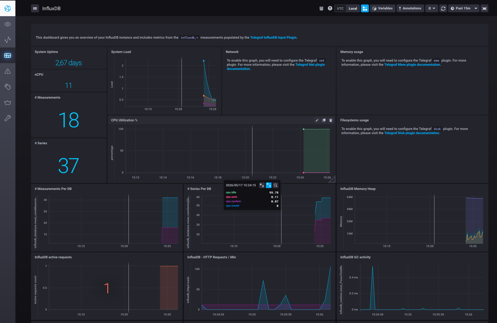
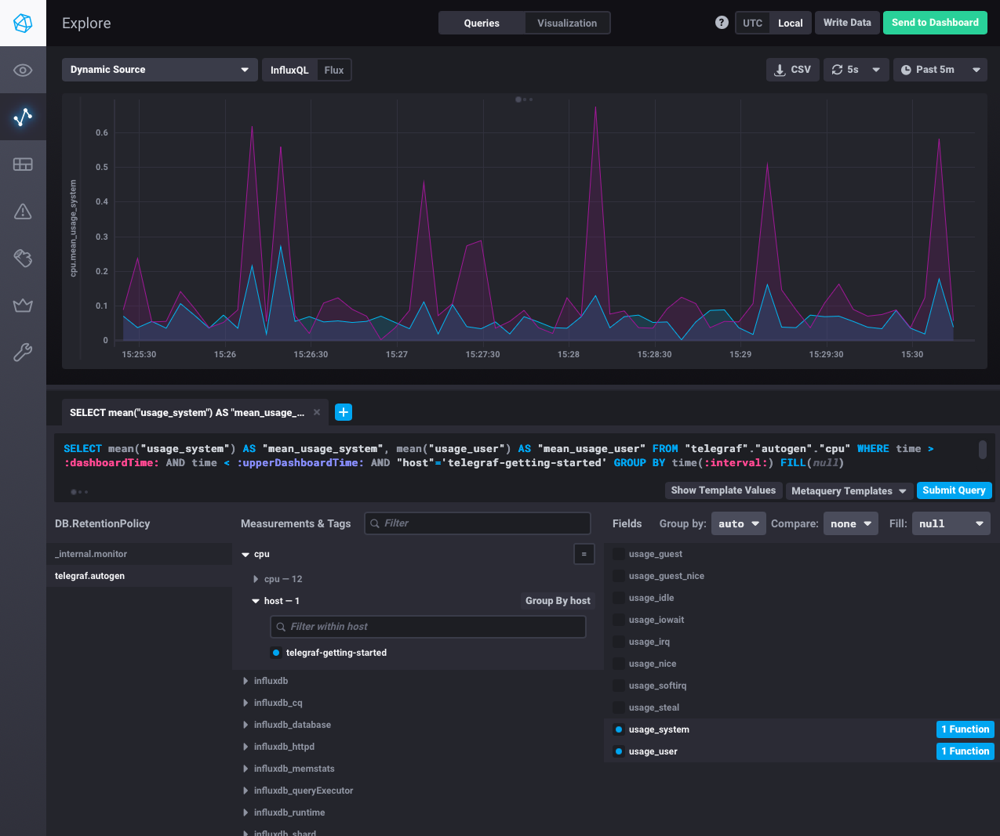
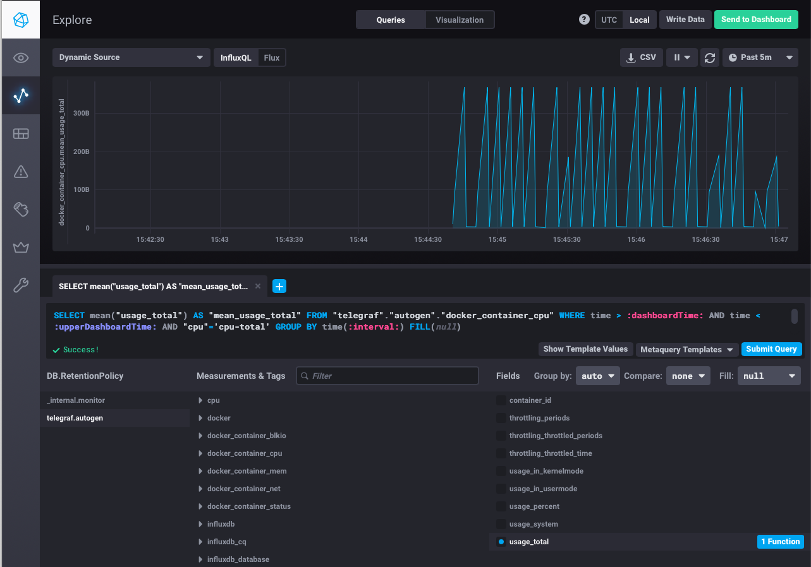

# Домашнее задание к занятию "13. Системы мониторинга"

---

## Обязательные задания

### Задание 1. Минимальный набор метрик

Платформа: HTTP-сервис с вычислениями (CPU-heavy), отчёты сохраняются на диск.

| Метрика | Обоснование |
|---|---|
| **CPU Utilization / Load Average** | Вычисления нагружают ЦПУ — ключевая метрика для данного сервиса |
| **RAM usage (used/available)** | Нехватка памяти приведёт к завершению процессов или деградации производительности |
| **Disk space used/free** | Отчёты пишутся на диск — без контроля диск переполнится и сервис перестанет работать |
| **Disk I/O (read/write latency, iops)** | Запись отчётов создаёт нагрузку на диск; замедление I/O = замедление сервиса |
| **HTTP request rate** | Показывает текущую нагрузку на сервис |
| **HTTP error rate (4xx, 5xx)** | Наличие ошибок сигнализирует о проблемах для пользователей |
| **HTTP response time (latency, p95/p99)** | Долгие ответы указывают на проблемы с производительностью вычислений |
| **inodes usage** | Отчёты = много файлов; можно исчерпать inodes даже при наличии свободного дискового пространства |

---

### Задание 2. Метрики для менеджера продукта

Технические метрики (RAM, inodes, CPU Load Average) неинтуитивны для бизнеса. Вместо них предлагаем **SLI/SLO-подход** — бизнес-ориентированные показатели качества обслуживания:

- **Availability (доступность)** — процент времени, когда сервис отвечает успешно. Например: _"Сервис был доступен 99.95% времени за месяц"_
- **SLA по времени ответа** — _"95% запросов обрабатываются быстрее 2 секунд"_
- **Error rate** — _"Менее 0.1% запросов завершились ошибкой"_
- **Throughput** — _"Платформа обработала 10 000 отчётов за сутки"_

Менеджеру предоставляется дашборд с понятными бизнес-показателями, а не сырые системные метрики.

---

### Задание 3. Сбор ошибок приложения без бюджета на log-систему

Варианты решения без выделения бюджета на полноценную систему логирования:

1. **Алерты на error rate** в существующей системе мониторинга (Prometheus + Alertmanager, Zabbix) — при появлении 5xx/4xx уведомление приходит в Slack/Telegram/email
2. **Sentry** (бесплатный self-hosted вариант) — система трекинга ошибок, разработчики видят стектрейсы, частоту, контекст без необходимости хранить полные логи
3. **rsyslog / journald** — централизация логов штатными средствами Linux, разработчики читают через `journalctl` или по SSH
4. **Простой скрипт-мониторинг** на bash/python, который парсит stderr/логи приложения и отправляет ошибки в Telegram/email

---

### Задание 4. Почему SLA не поднимается выше 70%?

**Формула:** `sum_2xx_requests / sum_all_requests`

**Ошибка:** в `sum_all_requests` попадают не только 2xx/4xx/5xx, но и **3xx (редиректы)**.

Если 30% запросов — редиректы (301, 302):
- 2xx = 70%, 3xx = 30%, 4xx = 0%, 5xx = 0%
- `70 / (70 + 30) = 70%` — именно это и наблюдается

**Исправленная формула:**
```
sum_2xx / (sum_2xx + sum_4xx + sum_5xx)
```

---

### Задание 5. Pull vs Push системы мониторинга

| | **Pull** | **Push** |
|---|---|---|
| **Принцип** | Сервер мониторинга сам запрашивает метрики у агентов | Агент сам отправляет метрики на сервер |
| **Плюсы** | Легко обнаружить недоступный хост; централизованный контроль конфигурации; удобно дебажить | Работает за NAT/firewall; подходит для короткоживущих задач (cron, batch); хорошо масштабируется горизонтально |
| **Минусы** | Не работает за NAT без доп. решений; при большом парке хостов — нагрузка на сервер опроса | Сложнее обнаружить потерю агента; агент должен знать адрес сервера; риск «шторма» при одновременной отправке |

---

### Задание 6. Pull / Push / Гибрид?

| Система | Модель | Пояснение |
|---|---|---|
| **Prometheus** | Pull + Push (гибрид) | Сам scrape-ит эндпоинты; Pushgateway для batch-задач |
| **TICK** (Telegraf+InfluxDB+Chronograf+Kapacitor) | Push | Telegraf собирает и отправляет данные в InfluxDB |
| **Zabbix** | Гибрид | Активный агент (push) + пассивный режим (pull) + SNMP |
| **VictoriaMetrics** | Гибрид | Принимает push (Telegraf, InfluxDB line protocol); поддерживает pull через Prometheus-совместимый scrape |
| **Nagios** | Pull + Гибрид | Active checks (pull) + Passive checks (push) |

---

### Задание 7. Запуск TICK-стэка

Склонирован репозиторий [influxdata/sandbox](https://github.com/influxdata/sandbox/tree/master).

В процессе запуска обнаружена проблема: оригинальный `docker-compose.yml` использует переменную `${TYPE}` и тег `influxdb:latest`, что приводит к запуску **InfluxDB v2.9.1** вместо v1.8. InfluxDB v2 несовместима с остальным стэком (Chronograf не поддерживает InfluxQL для v2-соединений) или у меня просто не получилось это сделать на macOS.

**Решение:** зафиксированы версии образов в `docker-compose.yml`:

```yaml
version: '3'
services:
  influxdb:
    image: influxdb:1.8
    volumes:
      - ./influxdb/data:/var/lib/influxdb
      - ./influxdb/config/:/etc/influxdb/
    ports:
      - "8086:8086"
      - "8082:8082"
      - "8089:8089/udp"

  telegraf:
    image: telegraf:1.28
    privileged: true
    environment:
      HOSTNAME: "telegraf-getting-started"
    links:
      - influxdb
    volumes:
      - ./telegraf/:/etc/telegraf/
      - /var/run/docker.sock:/var/run/docker.sock
    depends_on:
      - influxdb

  kapacitor:
    image: kapacitor:1.7
    volumes:
      - ./kapacitor/data/:/var/lib/kapacitor
      - ./kapacitor/config/:/etc/kapacitor/
    links:
      - influxdb
    ports:
      - "9092:9092"

  chronograf:
    image: chronograf:1.10
    environment:
      RESOURCES_PATH: "/usr/share/chronograf/resources"
    volumes:
      - ./chronograf/data/:/var/lib/chronograf/
    links:
      - influxdb
      - kapacitor
    ports:
      - "8888:8888"
    depends_on:
      - kapacitor
      - influxdb
      - telegraf
```

Запуск:
```bash
docker compose up -d
```

Скриншот веб-интерфейса Chronograf (`http://localhost:8888`):



---

### Задание 8. Data Explorer — метрики CPU

В веб-интерфейсе Chronograf открыта вкладка **Explore (Data Explorer)**.

Выбрана БД `telegraf.autogen`, measurement `cpu`, host `telegraf-getting-started`, поля `usage_system` и `usage_user`.

Сформированный InfluxQL-запрос:
```sql
SELECT mean("usage_system") AS "mean_usage_system", mean("usage_user") AS "mean_usage_user"
FROM "telegraf"."autogen"."cpu"
WHERE time > :dashboardTime: AND time < :upperDashboardTime:
AND "host"='telegraf-getting-started'
GROUP BY time(:interval:) FILL(null)
```

Скриншот с графиком утилизации CPU:



---

### Задание 9. Плагин Docker для Telegraf

Плагин `[[inputs.docker]]` уже присутствовал в конфигурации `telegraf/telegraf.conf`:

```toml
[[inputs.docker]]
  endpoint = "unix:///var/run/docker.sock"
  container_names = []
  timeout = "5s"
  perdevice = true
  total = false
```

В `docker-compose.yml` уже был смонтирован Docker socket:
```yaml
volumes:
  - /var/run/docker.sock:/var/run/docker.sock
```

**Проблема:** telegraf-образ использует `gosu` в entrypoint и принудительно переключается на пользователя `telegraf` (не root), поэтому получал `permission denied` при обращении к сокету (права `srw-rw---- root:root`).

**Решение:** выставлены права на сокет:
```bash
docker exec sandbox-telegraf-1 chmod 777 /var/run/docker.sock
```

После этого в `telegraf.autogen` появились метрики с префиксом `docker_*`:


